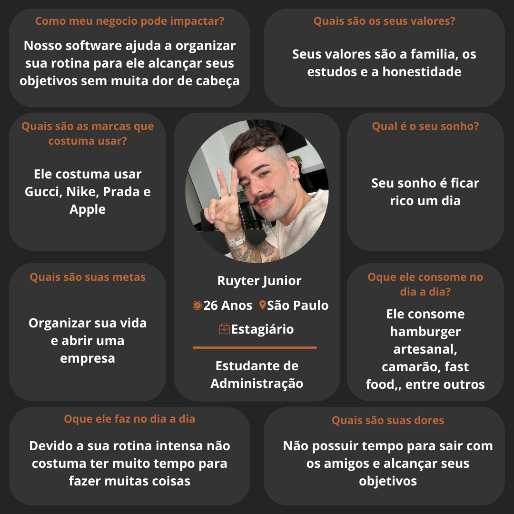

`TÍTULO DO PROJETO`  

# Má Organização do Tempo 2

`CURSO` 

## Engenharia de Software

## Participantes

`Os membros do grupo são:`

<b>
 - Daniel Victor Souza Saldanha 
 - Gabriel Ovidio Parreiras Vieira 
 - Gabriel Reis Lebron de Oliveira 
 - Gustavo Lima Dias 
 - Luís Othávio Rangel 
 - Vinicius Brito Dell Isola<b>

# Estrutura do Documento

- [Informações do Projeto](#informações-do-projeto)
  - [Participantes](#participantes)
- [Estrutura do Documento](#estrutura-do-documento)
- [Introdução](#introdução)
  - [Problema](#problema)
  - [Objetivos](#objetivos)
  - [Justificativa](#justificativa)
  - [Público-Alvo](#público-alvo)
- [Especificações do Projeto](#especificações-do-projeto)
  - [Personas e Mapas de Empatia](#personas-e-mapas-de-empatia)
  - [Histórias de Usuários](#histórias-de-usuários)
  - [Requisitos](#requisitos)
    - [Requisitos Funcionais](#requisitos-funcionais)
    - [Requisitos não Funcionais](#requisitos-não-funcionais)
  - [Restrições](#restrições)
- [Projeto de Interface](#projeto-de-interface)
  - [User Flow](#user-flow)
  - [Wireframes](#wireframes)
- [Metodologia](#metodologia)
  - [Divisão de Papéis](#divisão-de-papéis)
  - [Ferramentas](#ferramentas)
  - [Controle de Versão](#controle-de-versão)
- [**############## SPRINT 1 ACABA AQUI #############**](#-sprint-1-acaba-aqui-)
- [Projeto da Solução](#projeto-da-solução)
  - [Tecnologias Utilizadas](#tecnologias-utilizadas)
  - [Arquitetura da solução](#arquitetura-da-solução)
- [Avaliação da Aplicação](#avaliação-da-aplicação)
  - [Plano de Testes](#plano-de-testes)
  - [Ferramentas de Testes (Opcional)](#ferramentas-de-testes-opcional)
  - [Registros de Testes](#registros-de-testes)
- [Referências](#referências)

# Introdução

## Problema

## Má organização do tempo na atualidade: 

> A má gestão do tempo é um desafio contemporâneo que afeta indivíduos em diversos contextos, desde o ambiente profissional até a vida pessoal. Este problema é multifacetado, originando-se de uma combinação de fatores tecnológicos, sociais e individuais, e traz consequências significativas tanto para o bem-estar dos indivíduos quanto para a produtividade e eficácia organizacional. Algumas causas da má gestão do tempo são: a aceleração tecnológica e sobrecarga de informação pois a era digital trouxe consigo um fluxo incessante de informações e a constante disponibilidade de ferramentas de comunicação. Embora tenham o potencial de aumentar a eficiência, esses avanços também podem levar à sobrecarga de informações, onde a capacidade de processar e priorizar tarefas é comprometida. A dificuldade em desconectar-se de dispositivos e plataformas digitais também contribui para a diluição do foco e a procrastinação. As expectativas socioculturais em relação à produtividade e ao sucesso também exercem uma pressão significativa sobre a gestão do tempo. A valorização da ocupação constante e da multitarefa, muitas vezes, promove uma cultura de trabalho que favorece a quantidade em detrimento da qualidade, levando a uma gestão ineficaz do tempo e a falta de habilidades de gerenciamento de tempo, a educação formal dificilmente inclui treinamento em gerenciamento de tempo, deixando muitos indivíduos sem as ferramentas necessárias para planejar efetivamente suas atividades, estabelecer prioridades ou definir limites saudáveis entre trabalho e vida pessoal. A falta dessas habilidades fundamentais é um obstáculo significativo para uma gestão eficaz do tempo e como consequência temos a redução da produtividade e qualidade do trabalho, com a incapacidade de gerenciar o tempo de maneira eficaz pode levar a prazos perdidos, trabalho de baixa qualidade e oportunidades perdidas. No ambiente de trabalho, isso pode resultar em estresse, insatisfação e, eventualmente, esgotamento profissional, tambem pode ocorrer prejuízos ao bem-estar físico e mental; com a má gestão do tempo frequentemente resulta em estresse crônico, ansiedade e até depressão. O equilíbrio entre vida profissional e pessoal é comprometido, afetando negativamente a saúde física e mental. A longo prazo, isso pode levar a problemas de saúde mais sérios, incluindo doenças cardíacas e transtornos do sono alem do impacto nas relações pessoais e profissionais pois a incapacidade de cumprir compromissos e a constante sensação de estar sobrecarregado podem prejudicar relacionamentos pessoais e profissionais. A confiança e o respeito mútuo podem ser erodidos, afetando negativamente tanto a colaboração no local de trabalho quanto a harmonia em relações pessoais. A questão central que nossa aplicação se propõe a resolver se enraíza profundamente na problemática contemporânea da má gestão do tempo, especialmente no ambiente corporativo, onde as demandas são altas e o tempo é um recurso escasso e valioso. Este desafio transcende os limites individuais, afetando coletivamente a produtividade, o bem-estar dos colaboradores e, por extensão, a saúde organizacional como um todo.

### Contexto de uso:
> Ambiente Corporativo.Nossa aplicação é projetada para o ecossistema empresarial, que é caracteristicamente dinâmico, altamente conectado e frequentemente sujeito a prazos apertados e objetivos ambiciosos. As empresas, independentemente do seu porte ou do setor de atuação, enfrentam o desafio comum de otimizar a alocação do tempo de seus colaboradores para maximizar a eficiência e a eficácia.

### Tecnologias envolvidas:
> No coração desse ecossistema estão diversas tecnologias - desde plataformas de comunicação até ferramentas de gestão de projetos e sistemas de informação empresarial. Apesar de seu potencial para aumentar a produtividade, essas tecnologias também podem contribuir para a sobrecarga de informações e a dificuldade de gerenciar o tempo de forma eficaz, devido à constante interrupção e à multiplicidade de tarefas que exigem atenção simultânea.

### Desafio identificado:
> O desafio da má gestão do tempo manifesta-se por meio de prazos não cumpridos, projetos atrasados, sobrecarga de trabalho e, não raramente, o comprometimento da qualidade de vida dos colaboradores, levando a situações de estresse e burnout. A complexidade deste problema é ampliada pela natureza intangível do tempo, tornando sua gestão uma habilidade crítica, porém, muitas vezes, subdesenvolvida.

### Abordagem metodologica:
> Para abordar esse problema de forma holística, estamos considerando a implementação de metodologias como o Design Thinking. Esta abordagem centrada no ser humano nos permitirá explorar o problema de má gestão do tempo de maneira abrangente, desde a identificação das necessidades e desafios dos usuários até a concepção de soluções inovadoras. O Design Thinking, com suas fases de empatia, definição, ideação, prototipagem e teste, oferece um caminho promissor para entender profundamente o contexto em que nossa aplicação será utilizada e desenvolver uma solução que seja verdadeiramente eficaz e ressonante com as necessidades dos usuários finais.

# Objetivos

##  Objetivo Geral

> O objetivo geral deste projeto é desenvolver um software que aborde de maneira eficaz o problema da má gestão do tempo no ambiente corporativo. A solução buscará oferecer ferramentas que otimizem a alocação e utilização do tempo pelos colaboradores, com o intuito de melhorar a produtividade e eficiência organizacional, ao mesmo tempo em que promove o bem-estar dos funcionários e a harmonia entre a vida profissional e pessoal.

## Objetivos Específicos
### Mapear e Analisar as Ineficiências na Gestão do Tempo: 
> Este objetivo envolve conduzir uma pesquisa detalhada para identificar as principais causas da má gestão do tempo dentro do ambiente corporativo. A investigação focará em entender as rotinas diárias, as ferramentas de trabalho empregadas atualmente e os principais desafios enfrentados pelos colaboradores para gerenciar seu tempo de forma efetiva. Essa análise permitirá identificar as necessidades específicas dos usuários finais e orientará o desenvolvimento das funcionalidades do software.

### Desenvolver Funcionalidades de Agendamento e Priorização de Tarefas: 
> Com base nos dados coletados, o software incorporará funcionalidades robustas para o agendamento de tarefas e a definição de prioridades, permitindo que os usuários planejem suas atividades de maneira mais eficiente. Estas ferramentas serão desenhadas para serem intuitivas e fáceis de usar, garantindo que os colaboradores possam rapidamente organizar suas obrigações e identificar as prioridades, facilitando a concentração em tarefas que requerem atenção imediata e reduzindo a procrastinação.

### Facilitar a Comunicação e Colaboração entre Equipes: 
> Outro aspecto crucial do software será a incorporação de recursos que promovam uma comunicação eficaz e colaboração entre as equipes. Isso inclui funcionalidades que permitam compartilhar agendas, definir lembretes para prazos de projetos compartilhados e sincronizar tarefas entre diferentes membros da equipe. Ao melhorar a coordenação das atividades de equipe, o software visa reduzir duplicidades e mal-entendidos, otimizando o uso do tempo coletivo.

### Promover Práticas de Trabalho Saudáveis: 
> Além de funcionalidades técnicas, o software também incluirá componentes destinados a incentivar práticas de trabalho saudáveis. Isso pode envolver lembretes para pausas regulares, dicas para gerenciamento de estresse e ferramentas para ajudar os colaboradores a estabelecer limites claros entre o trabalho e o tempo pessoal. O objetivo é criar um ambiente de trabalho que suporte um equilíbrio saudável entre a vida profissional e pessoal, contribuindo para a redução do estresse e a prevenção da exaustão. 
> Ao atingir esses objetivos específicos, o projeto visa cumprir seu objetivo geral de criar uma solução de software capaz de enfrentar eficazmente o problema da má gestão do tempo no ambiente corporativo, oferecendo uma ferramenta prática e benéfica tanto para a organização quanto para seus colaboradores.

  
  
## Justificativa
> A escolha de desenvolver uma aplicação focada na melhoria da gestão do tempo no ambiente corporativo nasce de uma necessidade clara e crescente observada no mundo moderno do trabalho. Em uma era caracterizada por rápidas mudanças tecnológicas, globalização e uma incessante demanda por produtividade e eficiência, a capacidade de gerenciar o tempo eficazmente tornou-se uma habilidade crucial, não apenas para o sucesso individual, mas também para a sustentabilidade organizacional. Abaixo, detalhamos a importância e a motivação por trás deste projeto, bem como as razões para a escolha de nossos objetivos específicos.

### Importância e Motivação
> Necessidade de eficiência e produtividade. Empresas de todos os tamanhos enfrentam a pressão constante para entregar resultados, muitas vezes com recursos limitados. Uma gestão eficaz do tempo permite que as organizações maximizem esses recursos, aumentando a produtividade sem comprometer a qualidade do trabalho ou o bem-estar dos colaboradores.

### Bem-estar dos Colaboradores
> O equilíbrio entre a vida profissional e pessoal é fundamental para a saúde mental e física dos trabalhadores. Uma aplicação que auxilia na gestão do tempo pode reduzir significativamente os níveis de estresse e prevenir a exaustão profissional, contribuindo para um ambiente de trabalho mais saudável e sustentável.

### Adaptação às Mudanças Tecnológicas
> À medida que novas tecnologias são introduzidas nos ambientes de trabalho, surge a necessidade de adaptar as práticas de gestão do tempo. Uma aplicação que integra essas tecnologias pode facilitar uma transição suave, promovendo métodos de trabalho mais eficientes e adaptáveis.

### Razões para a Escolha dos Objetivos Específicos
> Foco na Análise Detalhada das Ineficiências
Optamos por concentrar nossos esforços na identificação das principais fontes de ineficiência de tempo através de pesquisas e análises detalhadas porque entender a raiz do problema é fundamental para desenvolver soluções eficazes. Utilizando questionários, entrevistas e análise de dados estatísticos, pretendemos ganhar insights profundos sobre as necessidades específicas dos usuários finais, permitindo que a aplicação seja cuidadosamente adaptada para atender a essas necessidades.

### Desenvolvimento de Funcionalidades Focadas
> A decisão de desenvolver funcionalidades específicas de agendamento, priorização de tarefas e facilitação da comunicação entre equipes baseia-se na convicção de que esses elementos são pilares fundamentais para uma gestão de tempo eficaz. A escolha desses focos foi influenciada por dados preliminares e feedback do potencial usuário, destacando a necessidade de ferramentas que não apenas organizem o tempo, mas também promovam uma colaboração eficiente e reduzam as barreiras à produtividade.

### Promoção de Práticas de Trabalho Saudáveis
> A inclusão de componentes destinados a incentivar práticas de trabalho saudáveis reflete nossa compreensão de que a tecnologia deve servir não apenas como uma ferramenta para aumentar a eficiência, mas também como um meio para promover o bem-estar. A ênfase em práticas saudáveis de trabalho é uma resposta direta à crescente preocupação com o equilíbrio entre trabalho e vida pessoal e o bem-estar dos colaboradores no ambiente corporativo. 
Ao aprofundar nesses aspectos específicos do software, nosso grupo visa não apenas abordar o problema da má gestão do tempo de uma maneira holística e eficaz, mas também contribuir para um ambiente de trabalho mais produtivo, saudável e equilibrado. Através da utilização de métodos investigativos como questionários e entrevistas, estamos comprometidos em compreender plenamente o problema em mãos e desenvolver uma solução que traga melhorias tangíveis para usuários finais e organizações.

 
  
## Público-Alvo

> A aplicação destinada à otimização da gestão do tempo no ambiente corporativo será projetada para atender a uma ampla gama de usuários, com diferentes perfis, conhecimentos prévios, relações com a tecnologia e posições hierárquicas. Abaixo, descrevemos de forma mais detalhada os diferentes perfis de usuários que visamos atender com nossa solução.

## Perfis de Usuários
### Colaboradores de Base
> Conhecimentos Prévios: Variável, podendo ir de usuários com pouco conhecimento técnico a indivíduos altamente capacitados em suas áreas de especialização.
Relação com a Tecnologia: Geralmente confortáveis com o uso de tecnologia, mas preferem soluções intuitivas e fáceis de usar que não exijam uma curva de aprendizado íngreme.
Relações Hierárquicas: Atuam em níveis operacionais ou de suporte dentro da organização, realizando tarefas específicas ou trabalhando em projetos sob a direção de gestores de equipe ou líderes de projeto.
### Gestores de Equipe e Líderes de Projeto
>Conhecimentos Prévios: Possuem uma compreensão abrangente dos processos de negócios de suas equipes, bem como habilidades de gerenciamento de projetos e liderança de equipe.
Relação com a Tecnologia: Experientes e exigentes quanto ao uso de tecnologia, valorizam ferramentas que ofereçam eficácia na comunicação e na gestão de tarefas e projetos.
Relações Hierárquicas: Responsáveis por liderar equipes, definir diretrizes e garantir a entrega de resultados. Interessados em ferramentas que possam facilitar o planejamento, a execução e o acompanhamento de projetos.
### Executivos e Tomadores de Decisão
>Conhecimentos Prévios: Possuem uma visão estratégica do negócio e um entendimento profundo dos objetivos organizacionais.
Relação com a Tecnologia: Buscam soluções tecnológicas que possam fornecer dados para suporte à tomada de decisão, melhorar a eficiência organizacional e contribuir para o alcance dos objetivos de negócio.
Relações Hierárquicas: Ocupam posições de alta gestão, focando na definição de estratégias e na otimização dos recursos organizacionais.
### Equipes de TI e Suporte Técnico
>Conhecimentos Prévios: Alto nível de conhecimento técnico, especializados em tecnologia da informação e suporte.
Relação com a Tecnologia: Profundamente envolvidos com a implementação, manutenção e suporte de soluções tecnológicas dentro da organização.
Relações Hierárquicas: Prestam suporte às necessidades tecnológicas de todos os níveis da organização, garantindo que as ferramentas e sistemas estejam funcionando eficientemente.
## Considerações Gerais
>A diversidade de perfis de usuários requer que nossa aplicação seja versátil e adaptável às diferentes necessidades e níveis de competência tecnológica. Além disso, é importante que a solução possa ser personalizada para atender às especificidades de cada função e nível hierárquico dentro da organização, garantindo que todos os usuários possam se beneficiar de uma gestão de tempo mais eficaz. A interface da aplicação deverá ser intuitiva e acessível, minimizando a necessidade de treinamento extensivo e permitindo que os usuários comecem a obter benefícios desde a implementação inicial. 
Ao compreender melhor o perfil dos usuários, podemos assegurar que o desenvolvimento da aplicação seja guiado por uma abordagem centrada no usuário, o que é fundamental para criar uma solução que não apenas atenda, mas também exceda suas expectativas e necessidades.

# Especificações do Projeto

> Nessa parte,  vamos abordar os principais clientes que nos almejamos que utilizem nosso software, quais são as requisitos funcionais e não funcionais do nosso projeto, e quais são suas prioridades dentro da programação de realização, e também as restrições que nosso projeto possui. Nos utilizamos principalmente o desing thinking, e as entrevistas para entender mais o problema e chegar em resultado que consiga agradar e solucionar a má gestão de tempo que muitas pessoas possuem.

## Personas e Mapas de Empatia

## Histórias de Usuários

Com base na análise das personas forma identificadas as seguintes histórias de usuários:

|EU COMO... `PERSONA`| QUERO/PRECISO ... `FUNCIONALIDADE` |PARA ... `MOTIVO/VALOR`                   | 
|--------------------|------------------------------------|------------------------------------------|
|Estudante           | Registrar minhas tarefas           | Não esquecer de fazê-las                 |
|Trabalhador         | Organizar minha rotina             | Descansar e passar tempo com a familia   |
|Desenvolvedor       | Um software prático e moldavel     | Permitir a evolução constante do software|

## Requisitos

As tabelas que se seguem apresentam os requisitos funcionais e não funcionais que detalham o escopo do projeto.

### Requisitos Funcionais

|ID    | Descrição do Requisito  | Prioridade |
|------|-----------------------------------------|----|
|RF-001| Permitir que o usuário cadastre tarefas ou compromissos | ALTA | 
|RF-002| Sinalizar através de alarmes os hórarios das atividades| MÉDIA |
|RF-003| Possibilitar salvar o login do usuario | ALTA | 
|RF-004| Permitir que o usuário crie listas de tarefa diárias | ALTA |
|RF-005| Permitir o cadastro de mais de uma tarefa | ALTA |
|RF-006| Permitir o compartilhamento de dados com outros usuários| MÉDIA |

### Requisitos não Funcionais

|ID     | Descrição do Requisito  |Prioridade |
|-------|-------------------------|----|
|RNF-001| O sistema deve ser responsivo para rodar em um dispositivos móvel | MÉDIA | 
|RNF-002| Deve processar requisições do usuário em no máximo 3s |  BAIXA | 
|RNF-003| Otimização do sistema ao máximo | MÉDIA | 
|RNF-004| Sistema de simples utilização | MÉDIA |
|RNF-005| Suporte para usuário | MÉDIA |

> Com base nas Histórias de Usuário, enumere os requisitos da sua
> solução. Classifique esses requisitos em dois grupos:
>
> - [Requisitos Funcionais (RF)](https://pt.wikipedia.org/wiki/Requisito_funcional):
>   correspondem a uma funcionalidade que deve estar presente na
>   plataforma (ex: cadastro de usuário).
>
> - [Requisitos Não Funcionais (RNF)](https://pt.wikipedia.org/wiki/Requisito_n%C3%A3o_funcional):
>   correspondem a uma característica técnica, seja de usabilidade,
>   desempenho, confiabilidade, segurança ou outro (ex: suporte a
>   dispositivos iOS e Android).
>
> Lembre-se que cada requisito deve corresponder à uma e somente uma
> característica alvo da sua solução. Além disso, certifique-se de que
> todos os aspectos capturados nas Histórias de Usuário foram cobertos.
> 
> **Links Úteis**:
> 
> - [O que são Requisitos Funcionais e Requisitos Não Funcionais?](https://codificar.com.br/requisitos-funcionais-nao-funcionais/)
> - [O que são requisitos funcionais e requisitos não funcionais?](https://analisederequisitos.com.br/requisitos-funcionais-e-requisitos-nao-funcionais-o-que-sao/)

## Restrições

O projeto está restrito pelos itens apresentados na tabela a seguir.

|ID| Restrição                                             |
|--|-------------------------------------------------------|
|01| O projeto deverá ser entregue até o final do semestre |
|02| Não pode ser desenvolvido um módulo de backend        |
|03| Não pode ser feito aplicativo                         |
|04| Não pode ser feito um sistema complexo                |

> Enumere as restrições à sua solução. Lembre-se de que as restrições
> geralmente limitam a solução candidata.
> 
> **Links Úteis**:
> - [O que são Requisitos Funcionais e Requisitos Não Funcionais?](https://codificar.com.br/requisitos-funcionais-nao-funcionais/)
> - [O que são requisitos funcionais e requisitos não funcionais?](https://analisederequisitos.com.br/requisitos-funcionais-e-requisitos-nao-funcionais-o-que-sao/)

# Projeto de Interface

Nosso projeto possui um sistema de interfaces minimalista e simples que colaboram para o conforto e entendimento do usuario. No momento são ao todo 6 interfaces totalmente criadas para facilitar e ajudar o usuario a acessar o software e utilizar-lo de maneira simples e adequada, atendendo as principais funçoes de um sistema cujo objetivo é ajudar a organizar a rotina. 

## User Flow

> 

> Fluxo de usuário (User Flow) é uma técnica que permite ao desenvolvedor
> mapear todo fluxo de telas do site ou app. Essa técnica funciona
> para alinhar os caminhos e as possíveis ações que o usuário pode
> fazer junto com os membros de sua equipe.
>
> **Links Úteis**:
> - [User Flow: O Quê É e Como Fazer?](https://medium.com/7bits/fluxo-de-usu%C3%A1rio-user-flow-o-que-%C3%A9-como-fazer-79d965872534)
> - [User Flow vs Site Maps](http://designr.com.br/sitemap-e-user-flow-quais-as-diferencas-e-quando-usar-cada-um/)
> - [Top 25 User Flow Tools & Templates for Smooth](https://www.mockplus.com/blog/post/user-flow-tools)

## Wireframes

LINK PARA MELHOR VISUALIZAÇÃO:

[Figma](https://www.figma.com/proto/Poeie0lrm3Qfnbh7NKgyQ3/Trabalho-Interdisciplinar?node-id=1-11&mode=design&t=VUSMkUHQmAhaExEL-1)

> 

> Wireframes são protótipos das telas da aplicação usados em design de interface para sugerir a
> estrutura de um site web e seu relacionamentos entre suas
> páginas. Um wireframe web é uma ilustração semelhante ao
> layout de elementos fundamentais na interface.
> 
> **Links Úteis**:
> - [Ferramentas de Wireframes](https://rockcontent.com/blog/wireframes/)
> - [Figma](https://www.figma.com/)
> - [Adobe XD](https://www.adobe.com/br/products/xd.html#scroll)
> - [MarvelApp](https://marvelapp.com/developers/documentation/tutorials/)

# Metodologia

> A metodologia que foi adotada pelo nosso grupo, foi o Desing Thinking. Essa metodologia permite analisar o problema na questão de má gestão do tempo de forma ampla. Essa metodologia, permitirá que nosso projeto quando estiver concluído seja totalmente eficaz para tais necessidades que os usuários necessitarem. Outra metodologia que utilizamos foi o Kanban, que se trata de um sistema de origem japonesa, que significa "cartão" e propõe o uso de cartões para indicar e noticiar como está o processo de cada tarefa que foi determinada para cada indivíduo do grupo. Já na questão de divisão de tarefas, cada integrante do grupo foi designado para uma tarefa, que no final do prazo deveria entrega-la pronta, mas caso determinado membro apresentasse alguma dúvida os outros membros ajudariam para que fosse concluída com êxito. Utilizamos algumas ferramentas, como o Miro,  que utilizamos para desenvolver o Desing Thinking, também foi utilizado o Figma, para o desenvolvimento e construção do protótipo interativo do projeto e usamos o Kanban para efetivar a visualização das tarefas que estão em aberto, em desenvolvimento e concluídas, além do Github, que usamos para reunir as modificações realizadas por cada membro no projeto.

## Divisão de Papéis

> <b>- Daniel Victor Souza Saldanha:</b> Ficou responsável pelo design thinking e pela apresentação do projeto.  
> <b>- Gabriel Ovidio Parreiras Vieira:</b> Ficou responsável pelo design thinking e pela apresentação do projeto.  
> <b>- Gabriel Reis Lebron de Oliveira:</b> Ficou responsável pela documentação das metodologias adotadas pelo grupo no desenvolvimento do projeto e pela documentação da divisão de tarefas entre os membros.  
> <b>- Gustavo Lima Dias:</b> Ficou responsável pela questão da especificação do projeto.  
> <b>- Luís Othávio Rangel:</b> Ficou responsável pelo desenvolvimento do projeto de interface, desde o fluxo do usuário até a construção do protótipo interativo.  
> <b>- Vinicius Brito Dell Isola:</b> Ficou responsável pela contextualização do projeto, desde o desenvolvimento da introdução até público alvo.
 
## Ferramentas

Ferramentas utilizadas: 

| Ambiente  | Plataforma              |Link de Acesso |
|-----------|-------------------------|---------------|
|Processo de Design Thinkgin  | Miro | https://miro.com/app/board/uXjVNiWktVo=/?share_link_id=67229329199Links | 
|Repositório de código | GitHub | https://github.com/XXXXXXX | 
|Hospedagem do site | Heroku |  https://XXXXXXX.herokuapp.com | 
|Protótipo Interativo | MavelApp ou Figma | https://www.figma.com/proto/Poeie0lrm3Qfnbh7NKgyQ3/Trabalho-Interdisciplinar?node-id=1-11&mode=design&t=VUSMkUHQmAhaExEL-1 | 

>
> Liste as ferramentas empregadas no desenvolvimento do
> projeto, justificando a escolha delas, sempre que possível.
> 
> As ferramentas empregadas no projeto são:
> 
> - Editor de código.
> - Ferramentas de comunicação
> - Ferramentas de diagramação
> - Plataforma de hospedagem
> 
> O editor de código foi escolhido porque ele possui uma integração com o
> sistema de versão. As ferramentas de comunicação utilizadas possuem
> integração semelhante e por isso foram selecionadas. Por fim, para criar
> diagramas utilizamos essa ferramenta por melhor captar as
> necessidades da nossa solução.
> 
> **Links Úteis - Hospedagem**:
> - [Getting Started with Heroku](https://devcenter.heroku.com/start)
> - [Crie seu Site com o HostGator](https://www.hostgator.com.br/como-publicar-seu-site)
> - [GoDady](https://br.godaddy.com/how-to)
> - [GitHub Pages](https://pages.github.com/)

## Controle de Versão

Nosso projeto possui as seguintes versões:
> - `dev`: Repertório do Github
> - `dev`: Desenvolvimento do projeto base do site
> - `feature`: Criação de nova interfaçe
> - `feature`: Criação de novas funcionalidades

> Discuta como a configuração do projeto foi feita na ferramenta de
> versionamento escolhida. Exponha como a gerência de tags, merges,
> commits e branchs é realizada. Discuta como a gerência de issues foi
> realizada.
> A ferramenta de controle de versão adotada no projeto foi o
> [Git](https://git-scm.com/), sendo que o [Github](https://github.com)
> foi utilizado para hospedagem do repositório `upstream`.
> 
> O projeto segue a seguinte convenção para o nome de branchs:
> 
> - `master`: versão estável já testada do software
> - `unstable`: versão já testada do software, porém instável
> - `testing`: versão em testes do software
> - `dev`: versão de desenvolvimento do software
> 
> Quanto à gerência de issues, o projeto adota a seguinte convenção para
> etiquetas:
> 
> - `bugfix`: uma funcionalidade encontra-se com problemas
> - `enhancement`: uma funcionalidade precisa ser melhorada
> - `feature`: uma nova funcionalidade precisa ser introduzida
>
> **Links Úteis**:
> - [Tutorial GitHub](https://guides.github.com/activities/hello-world/)
> - [Git e Github](https://www.youtube.com/playlist?list=PLHz_AreHm4dm7ZULPAmadvNhH6vk9oNZA)
> - [5 Git Workflows & Branching Strategy to deliver better code](https://zepel.io/blog/5-git-workflows-to-improve-development/)
>
> **Exemplo - GitHub Feature Branch Workflow**:
>
> 

# **############## SPRINT 1 ACABA AQUI #############**

# Projeto da Solução

......  COLOQUE AQUI O SEU TEXTO ......

## Tecnologias Utilizadas

......  COLOQUE AQUI O SEU TEXTO ......

> Descreva aqui qual(is) tecnologias você vai usar para resolver o seu
> problema, ou seja, implementar a sua solução. Liste todas as
> tecnologias envolvidas, linguagens a serem utilizadas, serviços web,
> frameworks, bibliotecas, IDEs de desenvolvimento, e ferramentas.
> Apresente também uma figura explicando como as tecnologias estão
> relacionadas ou como uma interação do usuário com o sistema vai ser
> conduzida, por onde ela passa até retornar uma resposta ao usuário.
> 
> Inclua os diagramas de User Flow, esboços criados pelo grupo
> (stoyboards), além dos protótipos de telas (wireframes). Descreva cada
> item textualmente comentando e complementando o que está apresentado
> nas imagens.

## Arquitetura da solução

......  COLOQUE AQUI O SEU TEXTO E O DIAGRAMA DE ARQUITETURA .......

> Inclua um diagrama da solução e descreva os módulos e as tecnologias
> que fazem parte da solução. Discorra sobre o diagrama.
> 
> **Exemplo do diagrama de Arquitetura**:
> 
> 

# Avaliação da Aplicação

......  COLOQUE AQUI O SEU TEXTO ......

> Apresente os cenários de testes utilizados na realização dos testes da
> sua aplicação. Escolha cenários de testes que demonstrem os requisitos
> sendo satisfeitos.

## Plano de Testes

......  COLOQUE AQUI O SEU TEXTO ......

> Enumere quais cenários de testes foram selecionados para teste. Neste
> tópico o grupo deve detalhar quais funcionalidades avaliadas, o grupo
> de usuários que foi escolhido para participar do teste e as
> ferramentas utilizadas.
> 
> **Links Úteis**:
> - [IBM - Criação e Geração de Planos de Teste](https://www.ibm.com/developerworks/br/local/rational/criacao_geracao_planos_testes_software/index.html)
> - [Práticas e Técnicas de Testes Ágeis](http://assiste.serpro.gov.br/serproagil/Apresenta/slides.pdf)
> -  [Teste de Software: Conceitos e tipos de testes](https://blog.onedaytesting.com.br/teste-de-software/)

## Ferramentas de Testes (Opcional)

......  COLOQUE AQUI O SEU TEXTO ......

> Comente sobre as ferramentas de testes utilizadas.
> 
> **Links Úteis**:
> - [Ferramentas de Test para Java Script](https://geekflare.com/javascript-unit-testing/)
> - [UX Tools](https://uxdesign.cc/ux-user-research-and-user-testing-tools-2d339d379dc7)

## Registros de Testes

......  COLOQUE AQUI O SEU TEXTO ......

> Discorra sobre os resultados do teste. Ressaltando pontos fortes e
> fracos identificados na solução. Comente como o grupo pretende atacar
> esses pontos nas próximas iterações. Apresente as falhas detectadas e
> as melhorias geradas a partir dos resultados obtidos nos testes.

# Referências

Referencias utilizadas no trabalho:
- https://miro.com/
- https://www.figma.com/

> Inclua todas as referências (livros, artigos, sites, etc) utilizados
> no desenvolvimento do trabalho.
> 
> **Links Úteis**:
> - [Formato ABNT](https://www.normastecnicas.com/abnt/trabalhos-academicos/referencias/)
> - [Referências Bibliográficas da ABNT](https://comunidade.rockcontent.com/referencia-bibliografica-abnt/)
